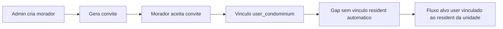

# Pesquisa PO e Diagnostico do CondoSync

## 1) Objetivo e recorte

Este documento consolida:
- benchmark das funcionalidades mais relevantes para sindico de condominio pequeno no Brasil;
- diagnostico do que ja existe no CondoSync;
- gaps de produto/UX com foco em fluxo real do usuario;
- proposta de novos modulos;
- roadmap 30/60/90 dias com KPIs.

Persona principal: **sindico morador ou sindico de pequeno condominio** que precisa operar financeiro e rotina de conveniencia com pouco tempo, pouca equipe e alta necessidade de clareza.

---

## 2) Benchmark: o que o mercado brasileiro entrega para condominio pequeno

Com base em materiais publicos de fornecedores focados em condominio (CondoSimples, Pix Condominio, uCondo, BRCondominio, SIN+), os blocos de valor mais recorrentes sao:

1. **Financeiro ponta a ponta**
   - emissao de cobrancas (boleto/PIX),
   - segunda via em autosservico,
   - inadimplencia com regua de cobranca,
   - prestacao de contas e relatorios.

2. **Comunicacao operacional**
   - mural/comunicados com push,
   - ocorrencias/chamados com status,
   - assembleia/enquete digital.

3. **Conveniencia do dia a dia**
   - reservas de areas comuns,
   - visitantes/portaria/correspondencias,
   - agenda de manutencao e fornecedores.

4. **Experiencia simples para sindico pequeno**
   - menos cliques para rotinas recorrentes,
   - automacoes para reduzir trabalho manual,
   - trilha clara de "o que fazer agora".

Referencias usadas:
- [CondoSimples](https://condosimples.com/)
- [Pix Condominio](https://www.pixcondominio.com.br/)
- [uCondo](https://www.ucondo.com.br/condominios/sistema-e-aplicativo-para-sindicos)
- [BRCondominio](https://www.brcondominio.com.br/planos.html)
- [SIN+](http://sistemacondominioonline.com.br/)

---

## 3) CondoSync hoje: matriz de cobertura

| Capability | Status | Evidencia no sistema |
|---|---|---|
| Cobrancas condominiais | Ja existe | `backend/src/modules/charges/`, `frontend/src/domains/charges/` |
| Segunda via por WhatsApp | Ja existe (novo) | `POST /condominiums/:condominiumId/charges/:chargeId/resend-whatsapp` em `backend/src/modules/charges/charges.controller.ts` |
| Despesas e resumo financeiro | Ja existe | `backend/src/modules/expenses/`, `frontend/src/domains/expenses/` |
| Dashboard financeiro | Ja existe | `backend/src/modules/dashboard/`, `frontend/src/domains/dashboard/` |
| Moradores e unidades | Ja existe (parcial UX) | `backend/src/modules/residents/`, `backend/src/modules/units/`, `frontend/src/domains/residents/`, `frontend/src/domains/units/` |
| Convites de acesso | Ja existe (parcial) | `backend/src/modules/invitations/`, `frontend/src/domains/invitations/` |
| Mural/comunicados | Ja existe | `backend/src/modules/bulletin/`, `frontend/src/domains/bulletin/` |
| Ocorrencias | Ja existe | `backend/src/modules/occurrences/`, `frontend/src/domains/occurrences/` |
| Enquetes | Ja existe | `backend/src/modules/polls/`, `frontend/src/domains/polls/` |
| Documentos | Ja existe | `backend/src/modules/documents/`, `frontend/src/domains/documents/` |
| Notificacoes em app | Parcial | backend pronto em `backend/src/modules/notifications/notifications.controller.ts`, sem modulo visivel dedicado no frontend |
| Reserva de areas comuns | Ausente | nao ha modulo dedicado em `backend/src/modules` e `frontend/src/domains` |
| Visitantes/portaria | Ausente | nao ha modulo dedicado |
| Multas/advertencias | Ausente | nao ha modulo dedicado |
| Manutencao preventiva/fornecedores | Ausente | nao ha modulo dedicado |

---

## 4) Diagnostico dos fluxos criticos atuais

## 4.1 Moradores + convite + associacao de acesso

### Fluxo atual (implementado)
1. Admin cadastra morador na unidade (`POST /condominiums/:condominiumId/units/:unitId/residents`).
2. Admin gera convite da unidade (`POST /condominiums/:condominiumId/invitations`).
3. Usuario aceita convite (`POST /invitations/:token/accept`), criando membership em `user_condominiums`.

### Gap principal
No aceite do convite, o sistema cria/atualiza usuario e membership, mas **nao vincula automaticamente esse usuario ao registro de morador** (`resident.userId`) ja existente.

Evidencia:
- Aceite cria `UserCondominium` em `backend/src/modules/invitations/invitations.service.ts`.
- Entidade de convite nao possui `residentId` em `backend/src/database/entities/condominium-invitation.entity.ts`.

### Impacto de negocio
Fluxos que dependem de `resident.user_id` podem falhar ou ficar vazios ate ajuste manual:
- minhas cobrancas (`backend/src/modules/charges/charges.service.ts`, metodo `listMineInCondo`),
- voto em enquete como responsavel (`backend/src/modules/polls/polls.service.ts`, consulta por `r.user_id` + `is_financial_responsible`),
- abrir ocorrencia (`backend/src/modules/occurrences/occurrences.service.ts`, validacao `where: { unitId, userId }`).

---

## 4.2 Exclusao de morador

Hoje existe criar/listar/editar/definir responsavel em `backend/src/modules/residents/residents.controller.ts`, mas **nao existe endpoint DELETE de morador**.

Impactos:
- cadastros ficam "acumulados" quando ha troca real de ocupante;
- operacao do sindico fica inconsistente com a rotina real do condominio;
- aumenta risco de comunicacao para pessoa errada.

---

## 4.3 Convite sem rastreabilidade de pessoa

Hoje o convite esta ligado a condominio/unidade/role, mas nao a um morador especifico (`residentId` ausente).

Impactos:
- o convite representa "vaga de acesso da unidade", nao "esta pessoa";
- dificulta auditoria e suporte ("quem foi convidado para qual cadastro?");
- aumenta divergencia entre cadastro de moradores e acesso digital.

---

## 5) Melhorias recomendadas (P0, P1, P2)

## P0 - Resolver dores imediatas do sindico

1. **Excluir morador (backend + frontend)**
   - adicionar `DELETE /condominiums/:condominiumId/units/:unitId/residents/:id`;
   - regra para responsavel financeiro (nao permitir excluir unico responsavel sem substituicao ou forcar reassociacao);
   - botao "Excluir morador" na tela de moradores com confirmacao.

2. **Anexar convite ao morador**
   - incluir `residentId` em convite (schema/DTO/validacoes);
   - no onboarding de morador, opcao "gerar convite para este morador";
   - exibir status do convite no card/lista do morador.

3. **Autoassociacao no aceite do convite**
   - ao aceitar convite, resolver `residentId` e atualizar `resident.userId` automaticamente;
   - fallback seguro quando houver conflito (ex.: usuario ja associado a outro morador da mesma unidade).

## P1 - Ganho operacional forte

4. **Inbox de notificacoes no frontend**
   - consumir `me/notifications`;
   - status lido/nao lido + badge no layout.

5. **Regua de cobranca basica**
   - reminders por estagio (D-3, D+1, D+5 etc.);
   - templates padrao e historico de envios.

6. **Checklist de onboarding da unidade**
   - guia visual de "unidade pronta": morador cadastrado, responsavel definido, convite enviado/aceito.

## P2 - Diferenciais para conveniencia

7. **Reserva de areas comuns**
   - agenda, regras por area, limite por unidade, aprovacao opcional.

8. **Visitantes e correspondencias**
   - pre-cadastro de visitante, registro de encomenda, confirmacao de retirada.

9. **Multas/advertencias + manutencao preventiva**
   - ocorrencia administrativa com trilha de penalidade;
   - agenda recorrente de manutencao e controle de fornecedor.

---

## 6) Novos modulos sugeridos (proposta de produto)

## 6.1 Modulo Reservas
- Valor: reduz conflitos de area comum e chamadas no WhatsApp do sindico.
- Escopo minimo: cadastro de area, regras, agenda, solicitacao, aprovacao/cancelamento, notificacao.
- Dependencias: unidades, moradores, notificacoes.

## 6.2 Modulo Visitantes/Portaria Leve
- Valor: melhora seguranca e organizacao sem precisar sistema de portaria complexo.
- Escopo minimo: visitante previsto por unidade, validade, observacoes, historico.
- Dependencias: unidades/moradores e notificacoes.

## 6.3 Modulo Multas e Advertencias
- Valor: formaliza disciplina condominial com rastreabilidade.
- Escopo minimo: abrir advertencia, converter para multa, anexar evidencia, timeline por unidade.
- Dependencias: ocorrencias, documentos, financeiro.

## 6.4 Modulo Manutencao e Fornecedores
- Valor: evita manutencao reativa e perda de prazo.
- Escopo minimo: plano de manutencao recorrente, OS simples, cadastro de fornecedor, checklist de execucao.
- Dependencias: despesas/documentos.

---

## 7) Roadmap proposto (30/60/90 dias)

## Onda 1 - 0 a 30 dias (P0)
- Excluir morador com regras de seguranca.
- Convite com `residentId`.
- Autoassociacao `user <-> resident` no aceite.
- Ajuste de UI em moradores para mostrar status de acesso (sem convite, convite pendente, acesso ativo).

## Onda 2 - 31 a 60 dias (P1)
- Inbox de notificacoes no frontend.
- Regua basica de cobranca.
- Checklist de onboarding por unidade.

## Onda 3 - 61 a 90 dias (P2)
- MVP de reservas.
- MVP de visitantes/correspondencias.
- Especificacao funcional de multas/advertencias e manutencao preventiva.

---

## 8) KPIs e criterios de sucesso

## Adoção e UX
- Tempo medio para "unidade pronta" (cadastro + responsavel + acesso ativo).
- Percentual de convites aceitos com associacao automatica concluida.
- Reducao de chamados internos sobre "nao consigo ver minhas cobrancas".

## Financeiro
- Percentual de cobrancas pagas no prazo.
- Taxa de inadimplencia 30+ dias.
- Quantidade de reenvios de 2a via por unidade/mês (para calibrar regua de cobranca).

## Operacional
- Volume de operacoes manuais do sindico (meta de queda por automacao).
- SLA de tratamento de ocorrencias.
- Uso de modulos de conveniencia (reservas/visitantes quando lancados).

---

## 9) Diagrama: fluxo atual x fluxo alvo (moradores e convites)

---

## 10) Recomendacao executiva

Para condominio pequeno, o maior ganho imediato vem de **consistencia de cadastro e acesso**.
Se o CondoSync garantir que:
- morador pode ser removido corretamente,
- convite nasce e termina vinculado ao morador,
- aceite de convite gera associacao automatica completa,

entao os modulos financeiros e de conveniencia ja existentes passam a entregar valor com muito menos friccao.
