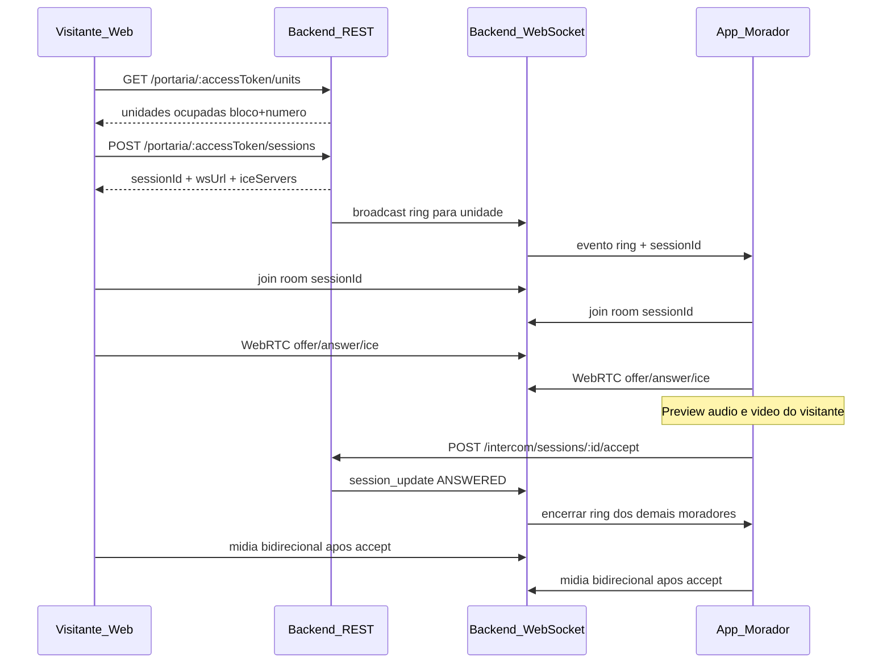

**CondoSync**

Portaria Virtual — Intercom por QR + Vídeo

Documento 5 de 5 · v1.0 (especificação)

Complementa: [`01_regras_historias_usuario.md`](./01_regras_historias_usuario.md) · Implementação futura conforme [`AGENTS.md`](../AGENTS.md)

---

# 1. Visão geral

## 1.1 Problema

- Visitantes na portaria dependem de interfone físico, porteiro ou ligação manual ao morador.
- Moradores não visualizam quem está na portaria antes de liberar a entrada.
- Não há registro digital rastreável da tentativa de contato na portaria.

## 1.2 Solução

- **QR Code** fixo na entrada do prédio aponta para uma página web pública do PWA CondoSync.
- O visitante escolhe a **unidade**, informa o **nome** e inicia uma **chamada de vídeo/áudio** (WebRTC).
- **Todos os moradores ativos** da unidade com o app instalado recebem o **ring**; o **primeiro a atender** encerra a chamada para os demais.
- Antes de atender, o morador já **ouve e vê** a câmera/microfone do visitante (preview).
- Sinalização WebRTC via **WebSocket** no backend; mídia peer-to-peer (STUN/TURN).
- App mobile: **react-native-webrtc** + **react-native-callkeep** (UI nativa de chamada; push VoIP na v2).

## 1.3 Decisões de produto (fixas)

| Tema | Decisão |
| --- | --- |
| Destinatário do ring | Todos os moradores **ativos** da unidade com dispositivo registrado; **primeiro `accept` válido** ganha |
| Página do visitante | Rota **pública** no PWA: `/portaria/:accessToken` |
| Push VoIP (APNs/FCM) | **Fora do escopo v1** — ver fase v2 e US-10.08 |
| Bounded context | Estender o módulo existente [`visitors`](../backend/src/modules/visitors/) (visitas agendadas + interfone) |
| Gravação de vídeo no servidor | Não na v1 |

## 1.4 Glossário

| Termo | Definição |
| --- | --- |
| **Visitante anônimo** | Pessoa na portaria sem conta CondoSync; acessa só via QR |
| **Token de portaria (`accessToken`)** | Identificador opaco no QR, vinculado a **um condomínio**; revogável pelo síndico |
| **Sessão de interfone (`intercom_session`)** | Agregado que liga visitante ↔ unidade ↔ negociação WebRTC e estado da chamada |
| **Ring** | Fase em que moradores são notificados da chamada (v1: in-app/WebSocket; v2: push VoIP) |
| **Preview** | Fluxo mídia **visitante → morador** antes do morador tocar em “Atender” |
| **Signaling** | Troca de SDP/ICE via WebSocket; não transporta áudio/vídeo |
| **Device registration** | Vínculo morador ↔ `device_id` + push token (preparado na v1, usado na v2) |

## 1.5 Relação com o módulo Visitantes existente

O sistema já possui [`VisitorEntry`](../backend/src/database/entities/visitor-entry.entity.ts) para visitas **previstas** (morador/síndico cadastra; status `EXPECTED` / `ARRIVED` / `CANCELED`). O interfone por QR é um fluxo **paralelo e complementar**:

- Interfone: visitante **espontâneo** na portaria, sem login.
- Visitas agendadas: continuam no PWA/app em [`VisitorsPage`](../frontend/src/domains/visitors/pages/VisitorsPage.tsx) e hub mobile em `condosync-app/src/features/visitors/`.

Quando a sessão de interfone for **atendida** (`ANSWERED`), o backend pode criar ou atualizar um `VisitorEntry` tipo `VISITA` com status `ARRIVED` para histórico unificado (RN-10.4).

Referência de unidade/morador: RN-01.2 em [`01_regras_historias_usuario.md`](./01_regras_historias_usuario.md).

---

# 2. Fluxo ponta a ponta

## 2.1 Diagrama de sequência (v1)



## 2.2 Máquina de estados da sessão

Estados literais (espelhar em `backend/src/common/enums`, `frontend/src/shared/types/api.ts`, `condosync-app/src/shared/types`):

| Estado | Descrição |
| --- | --- |
| `INITIATED` | Sessão criada; visitante ainda não publicou mídia |
| `RINGING` | Ring disparado para moradores da unidade |
| `PREVIEW` | Opcional no backend; no app, alias de `RINGING` com tracks remotas ativas |
| `ANSWERED` | Morador aceitou; mídia bidirecional permitida |
| `ENDED` | Chamada encerrada normalmente por morador ou visitante |
| `MISSED` | Timeout sem atendimento |
| `CANCELED_BY_VISITOR` | Visitante cancelou antes do atendimento |
| `REJECTED` | Morador recusou (pode ocorrer antes de outro atender) |
| `FAILED` | Erro técnico irrecuperável na sessão |

Transições permitidas:

```
INITIATED → RINGING → ANSWERED → ENDED
                 ├→ MISSED
                 ├→ CANCELED_BY_VISITOR
                 ├→ REJECTED (por morador; sessão pode continuar RINGING até timeout se ninguém mais atender)
                 └→ FAILED
```

---

# 3. Regras de negócio globais (RN-10)

> Numeração **RN-10** para não colidir com RN-01..05 do documento 01.

| ID | Regra |
| --- | --- |
| RN-10.1 | Cada condomínio possui **um ou mais** tokens de portaria ativos. O QR codifica `https://<host>/portaria/<accessToken>`. O `condominiumId` (UUID) **não** aparece na URL pública. |
| RN-10.2 | A listagem pública de unidades retorna apenas unidades com status **ocupado** (`UnitStatus.OCCUPIED`), com rótulo `bloco + número`. **Não** expor nome, CPF, telefone ou e-mail de moradores. |
| RN-10.3 | O nome do visitante é obrigatório: mínimo 2, máximo 80 caracteres após `trim`. Caracteres de controle rejeitados. |
| RN-10.4 | Ao iniciar chamada (`POST sessions`), criar `intercom_session`. Quando a sessão transitar para `ANSWERED`, criar ou atualizar `VisitorEntry` tipo `VISITA`, status `ARRIVED`, com `visitorName` da sessão e `unitId` escolhido. |
| RN-10.5 | O ring é enviado a **todos** os moradores **ativos** da unidade com registro de dispositivo válido. Timeout padrão: **45 segundos** (configurável por condomínio na v1.1). |
| RN-10.6 | Apenas o **primeiro** `accept` autenticado e autorizado (morador da unidade) torna a sessão `ANSWERED`. Demais moradores recebem evento `session_update` com motivo `ANSWERED_BY_OTHER`. |
| RN-10.7 | **Antes** do `accept`, o app do morador recebe apenas mídia **visitante → morador** (preview áudio + vídeo). **Após** o `accept`, áudio é bidirecional. Vídeo: visitante continua enviando; morador pode desligar a câmera local sem encerrar a chamada. |
| RN-10.8 | O visitante deve conceder permissão de **câmera e microfone** no navegador antes de habilitar “Chamar”. Se negar, a sessão não inicia (permanece `INITIATED` ou é cancelada). |
| RN-10.9 | Se ninguém atender dentro do timeout, a sessão vai para `MISSED`. Se o visitante sair ou cancelar, vai para `CANCELED_BY_VISITOR`. |
| RN-10.10 | Rate limit por IP e por `accessToken` (ex.: máximo 10 sessões iniciadas por token em 5 minutos). Respostas HTTP 429 com mensagem em PT-BR. |
| RN-10.11 | Logs estruturados (Pino) em toda transição de estado, com `condominium_id`, `session_id`, `unit_id`, `requestId`. **Não** persistir stream de vídeo/áudio no servidor na v1. |
| RN-10.12 | Mensagens WebSocket de signaling **não** substituem validação REST para `accept`, `reject` e `end`. O servidor é fonte de verdade do estado da sessão. |
| RN-10.13 | Token de portaria revogado ou expirado retorna 404 genérico (“Link de portaria inválido ou expirado”) sem revelar se o token existiu. |
| RN-10.14 | Multi-tenant: toda query e evento WS carrega `condominium_id` validado a partir do token ou membership JWT. Nunca confiar em `condominiumId` vindo do body sem validação cruzada. |

---

# 4. Histórias de usuário (US-10)

## US-10.01 · VISITANTE

**Escanear QR, escolher unidade e chamar o morador**

> Como visitante na portaria do condomínio, quero escanear um QR Code, escolher a unidade que vou visitar, informar meu nome e iniciar uma chamada de vídeo, para que o morador me veja e me ouça antes de liberar a entrada.

**Critérios de aceite:**

- Ao abrir o link do QR, vejo lista de unidades ocupadas (bloco + número), sem dados de moradores.
- Informo meu nome (validação RN-10.3).
- O navegador solicita câmera e microfone; só consigo “Chamar” após conceder ambos (RN-10.8).
- Após “Chamar”, vejo tela de status “Chamando…” com opção de cancelar.
- Se ninguém atender no timeout, vejo “Ninguém atendeu”.
- Se alguém atender, vejo “Em chamada” e consigo falar com o morador.

---

## US-10.02 · VISITANTE

**Acompanhar status da chamada na web**

> Como visitante, quero ver claramente se estou aguardando, se fui atendido ou se a chamada falhou, para saber se devo tentar de novo ou procurar outra forma de contato.

**Critérios de aceite:**

- Estados visíveis: Chamando, Em chamada, Ninguém atendeu, Cancelada, Recusada, Erro.
- Atualização via WebSocket `session_update`; polling REST de fallback a cada 3s se WS cair.
- Ao encerrar chamada pelo morador, a web exibe mensagem e encerra tracks locais.

---

## US-10.03 · MORADOR

**Ouvir e ver o visitante antes de atender**

> Como morador, quero receber a chamada da portaria no app e **já ouvir e ver** o visitante na tela de preview, para decidir com segurança se atendo ou recuso.

**Critérios de aceite:**

- Ao receber `ring`, abro tela/modal de chamada com nome do visitante e unidade.
- **Antes** de tocar em “Atender”, o áudio e o vídeo do visitante já estão reproduzindo (RN-10.7).
- Botões visíveis: Atender, Recusar.
- Se outro morador atender primeiro, a tela fecha com mensagem “Atendida por outro morador da unidade”.

---

## US-10.04 · MORADOR

**Atender, conversar e encerrar**

> Como morador, quero atender a chamada da portaria, falar com o visitante e encerrar quando terminar, para autorizar a entrada de forma prática.

**Critérios de aceite:**

- “Atender” chama `POST .../accept` e só então habilita meu microfone para o visitante (bidirecional).
- Posso encerrar a chamada a qualquer momento; visitante é notificado.
- Após encerrar, não permaneço em chamada nem consumo mídia em background.

---

## US-10.05 · MORADOR

**Recusar chamada**

> Como morador, quero recusar uma chamada da portaria quando não puder ou não quiser atender, para o visitante saber que a tentativa não foi aceita por mim.

**Critérios de aceite:**

- “Recusar” chama `POST .../reject`.
- Se ainda houver outros moradores em ring, a sessão permanece `RINGING` até timeout ou outro atender.
- Se eu for o único morador elegível, após recusa a sessão pode ir para `MISSED` ou `REJECTED` conforme política documentada em RN-BE-10.5.

---

## US-10.06 · SÍNDICO

**Gerar e gerenciar QR da portaria**

> Como síndico, quero gerar e renovar o link/QR da portaria virtual do meu condomínio, para colocar na entrada do prédio com segurança.

**Critérios de aceite:**

- Na área administrativa do PWA, vejo URL pública e QR para download/impressão.
- Posso **revogar** token atual e gerar novo (invalida QR antigo imediatamente).
- Apenas `ADMIN` e `SUB_ADMIN` executam esta ação.

---

## US-10.07 · SÍNDICO

**Histórico de chamadas da portaria**

> Como síndico, quero ver o histórico de tentativas de interfone (unidade, nome do visitante, horário, status), para auditoria e segurança.

**Critérios de aceite:**

- Lista paginada por condomínio com filtros por data, unidade e status.
- Exibe quem atendeu (morador) quando status `ANSWERED`.
- Não exibe gravação de vídeo (v1).

---

## US-10.08 · SISTEMA (v2)

**Push VoIP para acordar o app**

> Como morador com o app em segundo plano, quero receber push VoIP quando alguém chamar na portaria, para não perder visitantes quando o app não está aberto.

**Critérios de aceite (v2):**

- Push tipo VoIP (APNs PushKit / FCM high priority) com payload mínimo: `sessionId`, `condominiumId`, `unitLabel`, `visitorName`.
- CallKeep exibe UI nativa de chamada recebida.
- Ao atender pela UI nativa, o app abre na tela de preview/atendimento.
- Registro de device token no backend com opt-in do usuário.

**Fora do escopo v1** — ver seção 8.

---

# 5. Backend (NestJS)

Implementação futura conforme [`backend/AGENTS.md`](../backend/AGENTS.md): adapter pattern, migrations forward-only, mensagens PT-BR, multi-tenant.

## 5.1 Regras de negócio — backend (RN-BE-10)

| ID | Regra |
| --- | --- |
| RN-BE-10.1 | `accessToken` é string opaca (ex.: 32+ bytes base64url), armazenada com hash no banco; comparação timing-safe. |
| RN-BE-10.2 | `POST /portaria/:accessToken/sessions` é idempotente por janela de 30s para mesma combinação `(accessToken, unitId, visitorName normalizado)` — retorna sessão existente em `RINGING` em vez de duplicar. |
| RN-BE-10.3 | Apenas morador com vínculo **ativo** na `unitId` da sessão pode `accept`, `reject` ou `end`. Validar via `TenantMembershipService` (mesmo padrão de ocorrências/reservas). |
| RN-BE-10.4 | WebSocket Gateway autentica: visitante com `sessionGuestToken` de curta duração emitido no `POST sessions`; morador com JWT Keycloak. |
| RN-BE-10.5 | Se todos os moradores elegíveis `reject` antes do timeout e ninguém aceitou, transicionar para `REJECTED` ou `MISSED` (config: `intercom.rejectPolicy = all_rejected \| continue_ringing`). Default v1: `continue_ringing` até timeout. |
| RN-BE-10.6 | ICE servers retornados no `POST sessions`: STUN público + TURN credenciais de env (`WEBRTC_STUN_URLS`, `WEBRTC_TURN_URL`, `WEBRTC_TURN_USERNAME`, `WEBRTC_TURN_CREDENTIAL`). |
| RN-BE-10.7 | Throttler global + regra específica RN-10.10 no controller público de portaria. |

## 5.2 Histórias de usuário — backend (US-BE-10)

```
US-BE-10.01 · API PÚBLICA
Expor unidades para visitante via token
"Como API, devo listar unidades ocupadas de um condomínio quando o accessToken é válido, sem exigir JWT."
Critérios de Aceite:
GET /api/v1/portaria/:accessToken/units retorna 200 com array { id, block, number, label }
Token inválido/revogado retorna 404 com mensagem PT-BR genérica
Não retorna moradores nem dados sensíveis
```

```
US-BE-10.02 · API PÚBLICA
Criar sessão de interfone
"Como API, devo criar sessão, disparar ring e retornar dados para WebRTC/WS."
Critérios de Aceite:
POST body { unitId, visitorName } validado com class-validator
Resposta inclui sessionId, guestWsToken, wsUrl, iceServers, expiresAt
Persiste intercom_session em INITIATED → RINGING
Enfileira ou emite evento ring para device registrations da unidade
```

```
US-BE-10.03 · API AUTENTICADA
Aceitar, recusar e encerrar sessão
"Como morador autenticado, devo controlar a sessão da minha unidade via REST autoritativo."
Critérios de Aceite:
POST /api/v1/intercom/sessions/:sessionId/accept|reject|end
accept com lock otimista: segundo accept retorna 409 "Chamada já atendida por outro morador."
reject/end validam membership na unidade da sessão
```

```
US-BE-10.04 · WEBSOCKET
Relay de signaling WebRTC
"Como gateway WS, devo relayar mensagens SDP/ICE apenas entre participantes da mesma sessionId autorizados."
Critérios de Aceite:
Namespace /intercom (ou path /ws/intercom)
Eventos: signal { type, sdp?, candidate? }, ring, session_update, participant_joined
Mensagens malformadas ou room incorreta: desconectar com código documentado
```

## 5.3 Modelo de dados sugerido

| Tabela | Campos principais |
| --- | --- |
| `intercom_access_tokens` | `id`, `condominium_id`, `token_hash`, `label`, `revoked_at`, `expires_at`, `created_at` |
| `intercom_sessions` | `id`, `condominium_id`, `unit_id`, `access_token_id`, `visitor_name`, `status`, `answered_by_resident_id`, `visitor_entry_id` (nullable), `ring_expires_at`, `created_at`, `ended_at` |
| `intercom_session_events` | auditoria opcional: `session_id`, `event`, `payload_json`, `created_at` |
| `device_registrations` | `id`, `user_id`, `resident_id`, `platform`, `push_token`, `voip_token` (v2), `last_seen_at` |

Migration: timestamp + `IF NOT EXISTS`; enums Postgres para `intercom_session_status`.

## 5.4 Contratos HTTP (resumo)

### Públicos (`@Public()`)

| Método | Path | Descrição |
| --- | --- | --- |
| GET | `/api/v1/portaria/:accessToken/units` | Lista unidades ocupadas |
| POST | `/api/v1/portaria/:accessToken/sessions` | Inicia sessão |
| GET | `/api/v1/portaria/sessions/:sessionId/status` | Status para polling visitante |

### Autenticados

| Método | Path | Role |
| --- | --- | --- |
| POST | `/api/v1/condominiums/:condominiumId/intercom/tokens` | ADMIN, SUB_ADMIN |
| DELETE | `/api/v1/condominiums/:condominiumId/intercom/tokens/:tokenId` | ADMIN, SUB_ADMIN |
| GET | `/api/v1/condominiums/:condominiumId/intercom/sessions` | ADMIN, SUB_ADMIN |
| POST | `/api/v1/intercom/sessions/:sessionId/accept` | Morador da unidade |
| POST | `/api/v1/intercom/sessions/:sessionId/reject` | Morador da unidade |
| POST | `/api/v1/intercom/sessions/:sessionId/end` | Morador que atendeu ou visitante via guest token |
| POST | `/api/v1/intercom/devices` | Morador — registrar device (v1 preparação) |

Envelope de erro: `ErrorResponseDto` existente (`message` em PT-BR).

## 5.5 WebSocket — eventos

| Evento | Direção | Payload (resumo) |
| --- | --- | --- |
| `ring` | servidor → app | `{ sessionId, unitId, unitLabel, visitorName, condominiumId }` |
| `signal` | cliente ↔ servidor | `{ sessionId, type, sdp?, candidate? }` |
| `session_update` | servidor → todos | `{ sessionId, status, answeredBy?, reason? }` |
| `participant_joined` | servidor → sala | `{ sessionId, role: guest \| resident }` |

## 5.6 Estrutura de código sugerida

```
backend/src/modules/visitors/
├── visitors.module.ts          # importa IntercomModule
├── intercom/
│   ├── intercom.module.ts
│   ├── intercom-public.controller.ts
│   ├── intercom-sessions.controller.ts
│   ├── intercom-tokens.controller.ts
│   ├── intercom.gateway.ts
│   ├── intercom.service.ts
│   ├── intercom-session.machine.ts   # FSM pura
│   └── dto/
```

Adapter opcional v2+: `adapters/intercom-signaling/` se WS for extraído.

## 5.7 Não-escopo backend v1

- Gravação S3 de chamadas
- Transcrição de áudio
- Integração com message-server / WhatsApp para ring
- Kafka para eventos de interfone

---

# 6. Frontend (PWA React + Vite)

Implementação futura conforme [`frontend/AGENTS.md`](../frontend/AGENTS.md).

## 6.1 Regras de negócio — frontend (RN-FE-10)

| ID | Regra |
| --- | --- |
| RN-FE-10.1 | Rota `/portaria/:accessToken` é **pública** (fora de `ProtectedRoute`), sem sidebar do condomínio. |
| RN-FE-10.2 | UI **mobile-first**, touch-friendly, contraste alto (uso externo à sombra). |
| RN-FE-10.3 | Chamadas HTTP públicas usam instância axios **sem** interceptor de refresh JWT (ex.: `publicApi` em `shared/lib/`). |
| RN-FE-10.4 | WebRTC no browser: preferir API nativa `RTCPeerConnection`; biblioteca auxiliar permitida (`simple-peer` ou equivalente) desde que não duplique estado de sessão. |
| RN-FE-10.5 | Ao desmontar página ou `ENDED`/`MISSED`, parar todas as `MediaStreamTrack` e fechar `RTCPeerConnection`. |
| RN-FE-10.6 | Admin: seção “Portaria virtual” em configurações do condomínio — QR (canvas ou lib `qrcode.react`), copiar URL, revogar token. |

## 6.2 Histórias de usuário — frontend (US-FE-10)

```
US-FE-10.01 · VISITANTE
Wizard da portaria em rota pública
"Como visitante, quero um fluxo linear: unidade → nome → permissões → chamar."
Critérios de Aceite:
Passo 1: select/busca de unidade
Passo 2: input nome com validação Zod espelhando RN-10.3
Passo 3: preview local da câmera antes de chamar
Passo 4: tela de chamada com status e botão cancelar
```

```
US-FE-10.02 · VISITANTE
Conectar WebSocket e WebRTC
"Como página pública, devo negociar mídia com o morador via signaling WS."
Critérios de Aceite:
Conecta WS com guestWsToken após POST sessions
Publica offer após tracks locais prontos
Reage a session_update ANSWERED para UI "Em chamada"
```

```
US-FE-10.03 · SÍNDICO
Gerenciar QR no PWA autenticado
"Como síndico, quero ver e baixar o QR da portaria nas configurações."
Critérios de Aceite:
Apenas ADMIN/SUB_ADMIN
Exibe aviso de revogação ao gerar novo token
Domínio sugerido: frontend/src/domains/intercom/
```

## 6.3 Estrutura sugerida

```
frontend/src/domains/intercom/
├── pages/
│   ├── PortariaPage.tsx           # rota pública /portaria/:accessToken
│   └── IntercomSettingsPage.tsx   # admin QR (ou seção em condominiums)
├── hooks/
│   ├── usePortaria.ts
│   └── useIntercomSignaling.ts
├── services/
│   ├── portaria-public.service.ts
│   └── intercom-admin.service.ts
├── schemas/
│   └── portaria.schema.ts
└── components/
    ├── UnitPicker.tsx
    ├── VisitorCallStatus.tsx
    └── LocalVideoPreview.tsx
```

Registrar em [`frontend/src/app/router.tsx`](../frontend/src/app/router.tsx):

```ts
{ path: '/portaria/:accessToken', element: withSuspense(<PortariaPage />) }
```

## 6.4 Não-escopo frontend v1

- Instalação PWA obrigatória para visitante
- Chat de texto paralelo
- Múltiplos idiomas
- Gravação local no browser

---

# 7. App mobile (Expo / React Native)

Implementação futura conforme [`condosync-app/AGENTS.md`](../condosync-app/AGENTS.md) e docs Expo v55.

## 7.1 Dependências planejadas

| Pacote | Uso |
| --- | --- |
| `react-native-webrtc` | `RTCPeerConnection`, tracks, renderização vídeo |
| `react-native-callkeep` | UI nativa de chamada (foreground v1; background v2) |
| Cliente WebSocket | Signaling (ex.: reconexão com backoff) |

Config nativa (EAS Build): permissões câmera/microfone, Background Modes VoIP (iOS, v2).

## 7.2 Regras de negócio — app (RN-APP-10)

| ID | Regra |
| --- | --- |
| RN-APP-10.1 | Fluxo de interfone é **independente** do hub de visitas agendadas (`features/visitors`); nova feature `features/intercom/`. |
| RN-APP-10.2 | Tela de chamada recebida exibe preview remoto **antes** do botão Atender (RN-10.7). |
| RN-APP-10.3 | `accept` sempre via REST; só após sucesso habilita envio de áudio local ao visitante. |
| RN-APP-10.4 | Ao receber `ANSWERED_BY_OTHER`, fechar peer connection e descartar UI de chamada. |
| RN-APP-10.5 | v1 sem push: ring chega com app em **foreground** via WS; menu dev “Simular ring” com `sessionId` fixo para QA. |
| RN-APP-10.6 | CallKeep v1: integrar em foreground para validar UX; documentar limitação até v2. |
| RN-APP-10.7 | Registrar device: `POST /intercom/devices` após login com `platform`, `pushToken` opcional na v1. |

## 7.3 Histórias de usuário — app (US-APP-10)

```
US-APP-10.01 · MORADOR
Receber ring e exibir preview
"Como morador com app aberto, quero ver e ouvir o visitante assim que o ring chegar."
Critérios de Aceite:
Modal ou stack IntercomIncoming com visitorName e unitLabel
Vídeo remoto em RTCView antes de Atender
Ringtone/vibração configurável
```

```
US-APP-10.02 · MORADOR
Atender e encerrar via WebRTC
"Como morador, quero completar a chamada após accept REST."
Critérios de Aceite:
accept → answer SDP → áudio bidirecional
Botão encerrar → POST end + cleanup tracks
```

```
US-APP-10.03 · DEV/QA
Simular ring sem push
"Como desenvolvedor, quero disparar tela de chamada com sessionId para testes."
Critérios de Aceite:
Flag __DEV__ ou tela oculta em Settings
Não compilar em release store sem flag
```

## 7.4 Estrutura sugerida

```
condosync-app/src/features/intercom/
├── screens/
│   ├── IntercomIncoming/
│   │   ├── IntercomIncomingView.tsx
│   │   └── useIntercomIncoming.ts
│   └── IntercomActive/
├── services/
│   ├── intercom-api.service.ts
│   └── intercom-signaling.service.ts
├── hooks/
│   └── useIntercomCallKeep.ts
└── types/
    └── intercom.ts
```

Deep link (v2): `condosync://intercom/:sessionId`.

## 7.5 Não-escopo app v1

- Push VoIP real (APNs/FCM)
- CallKeep em background confiável
- Picture-in-picture
- Histórico de chamadas no app (fica no PWA admin na v1)

---

# 8. Matriz de responsabilidades e fases

## 8.1 Quem faz o quê (v1)

| Capacidade | Backend | Frontend PWA | App |
| --- | --- | --- | --- |
| Token/QR condomínio | CRUD tokens | UI admin + QR | — |
| Lista unidades pública | GET units | UI visitante | — |
| Criar sessão | POST sessions | Wizard + mídia | — |
| Signaling WebRTC | WS gateway | WS client visitante | WS client morador |
| Accept/reject/end | REST autoritativo | — | UI morador |
| Preview antes atender | Política de tracks | Envia vídeo/áudio | Recebe remoto |
| Ring moradores | WS + devices | — | WS (foreground) |
| Histórico | GET sessions admin | Tabela admin | — |
| Push VoIP | v2 | — | v2 |

## 8.2 Roadmap

| Fase | Entregas |
| --- | --- |
| **v1 (MVP)** | REST público + WS signaling + `/portaria/:accessToken` + app preview/atender (foreground) + admin QR/histórico + **sem** push lojas |
| **v1.1** | TURN produção, métricas, testes e2e Playwright (web) + detox/manual (app), política `reject` configurável |
| **v2** | Push VoIP, CallKeep background, registro APNs/FCM, deep link, publicação App Store / Play Console |

## 8.3 Workaround v1 (sem push)

1. Morador mantém app aberto ou em recentes durante testes de portaria.
2. Botão “Simular ring” (US-APP-10.03) com `sessionId` de sessão real.
3. Notificação in-app opcional (não VoIP) — **não substitui** US-10.08; apenas paliativo de QA.

---

# 9. Referências técnicas e riscos

## 9.1 Infra WebRTC

- **STUN**: descoberta de endereço público.
- **TURN**: obrigatório em produção para visitantes atrás de CGNAT e redes móveis restritivas.
- Variáveis de ambiente documentadas em `backend/config/env.schema.ts` (a criar na implementação).

## 9.2 Segurança

- Token de portaria revogável; rotacionar após vazamento.
- Rate limit RN-10.10.
- Guest WS token de curta duração (ex.: 15 min), escopo apenas `sessionId`.
- Não logar SDP completo em produção (tamanho + dados de rede).

## 9.3 Riscos

| Risco | Mitigação |
| --- | --- |
| NAT simétrico bloqueia P2P | TURN gerenciado |
| iOS rejeita app sem declaração de VoIP | Push/CallKeep apenas na v2 com capabilities corretas |
| Abuso do endpoint público | Rate limit + captcha v1.1 se necessário |
| Corrida em dois accepts | Lock transacional / 409 no segundo |
| Bateria/dados móveis do morador | Preview só durante ring; encerrar tracks ao fechar |

## 9.4 Referências no monorepo

| Recurso | Caminho |
| --- | --- |
| AGENTS raiz | [`AGENTS.md`](../AGENTS.md) |
| Módulo visitantes (CRUD atual) | [`backend/src/modules/visitors/`](../backend/src/modules/visitors/) |
| Entity VisitorEntry | [`visitor-entry.entity.ts`](../backend/src/database/entities/visitor-entry.entity.ts) |
| Endpoints públicos (padrão) | [`invitations.controller.ts`](../backend/src/modules/invitations/invitations.controller.ts) |
| Router PWA | [`frontend/src/app/router.tsx`](../frontend/src/app/router.tsx) |
| Hub visitantes app | [`condosync-app/src/features/visitors/`](../condosync-app/src/features/visitors/) |
| Notificações in-app (≠ VoIP) | [`backend/src/modules/notifications/`](../backend/src/modules/notifications/) |

## 9.5 Enums a alinhar na implementação

Sincronizar literais entre backend (`common/enums`), `frontend/src/shared/types/api.ts` e `condosync-app/src/shared/types`:

- `IntercomSessionStatus`: `INITIATED`, `RINGING`, `PREVIEW`, `ANSWERED`, `ENDED`, `MISSED`, `CANCELED_BY_VISITOR`, `REJECTED`, `FAILED`
- Eventos WS: `ring`, `signal`, `session_update`, `participant_joined`
- Motivo `session_update`: `ANSWERED_BY_OTHER`, `TIMEOUT`, `VISITOR_LEFT`

---

# 10. Checklist de implementação (referência)

Use este checklist nas PRs futuras; **não** faz parte do escopo deste documento.

**Backend**

- [ ] Migrations `intercom_*` + enums
- [ ] Controllers públicos `@Public()` + guards morador
- [ ] `IntercomGateway` + testes FSM
- [ ] Env STUN/TURN no schema Zod
- [ ] Vínculo `VisitorEntry` em `ANSWERED`
- [ ] `npx tsc --noEmit && npm run lint && npm test`

**Frontend**

- [ ] Domínio `intercom/` + rota pública
- [ ] `publicApi` sem JWT
- [ ] WebRTC + WS visitante
- [ ] Admin QR em configurações
- [ ] `npm run lint && npm run build`

**App**

- [ ] `react-native-webrtc` + permissões
- [ ] Telas Incoming/Active + WS
- [ ] CallKeep foreground (v1)
- [ ] Device registration endpoint
- [ ] `npx tsc --noEmit`

---

*Fim do documento 05 — Portaria Virtual (Intercom por QR).*
