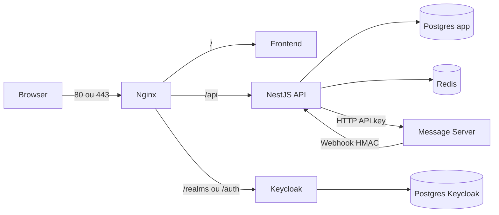

# Deploy CondoSync na VPS — arquivos e subida por serviço

Este guia descreve os artefatos de deploy do monorepo e como subir cada componente na VPS de forma independente (sem usar o compose de desenvolvimento da raiz).

## O que existe no repositório

O monorepo **não usa CI/CD de imagens** (sem GHCR por padrão). Em produção o fluxo é: **clone na VPS → `git pull` → build Docker local** → três arquivos Compose em `infra/`.

### Arquivos de deploy (produção)

| Categoria | Arquivos |
|-----------|----------|
| **Compose prod** | [`docker-compose.prod.yml`](docker-compose.prod.yml) (base: postgres, keycloak-db, keycloak, redis, nginx, stubs frontend/message-server), [`docker-compose.api.yml`](docker-compose.api.yml) (API NestJS), [`docker-compose.build.yml`](docker-compose.build.yml) (build local de api, frontend e message-server) |
| **Env** | [`.env.prod.example`](.env.prod.example) (DNS+TLS), [`.env.prod.ip-only.example`](.env.prod.ip-only.example) (HTTP por IP) → você cria **`infra/.env.prod`** (não commitar) |
| **Nginx** | [`nginx/nginx.conf`](nginx/nginx.conf), [`nginx/nginx.ip-only.conf`](nginx/nginx.ip-only.conf) |
| **Keycloak** | [`keycloak/realm-main.json`](keycloak/realm-main.json) (import no primeiro boot) |
| **Dockerfiles** | [`../backend/Dockerfile`](../backend/Dockerfile), [`../frontend/Dockerfile`](../frontend/Dockerfile), [`../message-server-main/Dockerfile`](../message-server-main/Dockerfile) |
| **Scripts canônicos** | [`../scripts/vps-up.sh`](../scripts/vps-up.sh) (stack completo), [`../scripts/vps-rebuild.sh`](../scripts/vps-rebuild.sh) (um serviço), [`scripts/deploy-api.sh`](scripts/deploy-api.sh), [`scripts/deploy-frontend.sh`](scripts/deploy-frontend.sh), [`scripts/deploy-message-server.sh`](scripts/deploy-message-server.sh) |
| **Bootstrap / TLS** | [`scripts/setup-ec2.sh`](scripts/setup-ec2.sh), [`scripts/init-ssl.sh`](scripts/init-ssl.sh), [`scripts/activate-https.sh`](scripts/activate-https.sh) |
| **Documentação relacionada** | [README.md](README.md), [DEPLOY_IP.md](DEPLOY_IP.md), [OPERATIONS_CHECKLIST.md](OPERATIONS_CHECKLIST.md) |

### Arquivos de desenvolvimento (não usar na VPS)

- [`../docker-compose.yml`](../docker-compose.yml) — inclui apenas [`infra/dev/*.yml`](dev/)
- [`../scripts/dev.sh`](../scripts/dev.sh) — separa `deps` / `api` / `msg` **só em dev**
- No dev, o frontend costuma rodar no host (`npm run dev` em `frontend/`), não como no compose de produção.

### Fora do compose Docker

- **`admin/`** — back-office; `make admin-dev` / build estático separado (não está no compose prod).
- **`condosync-app/`** — app mobile Expo; distribuição própria (stores), não coberta pelos composes.

### Script `deploy.sh` (raiz `infra/scripts`)

[`deploy.sh`](scripts/deploy.sh) faz **`git pull` + `docker compose` com os três arquivos + `up -d --build`**. Use quando quiser atualizar **todo** o stack após mudanças no repositório. Para só um serviço, prefira [`../scripts/vps-rebuild.sh`](../scripts/vps-rebuild.sh) ou os `deploy-*.sh`.  
Rollback após `git checkout <commit>`: `SKIP_GIT_PULL=1 bash infra/scripts/deploy.sh`.

---

## Arquitetura em produção



**Camadas lógicas:**

- **core (estado):** `postgres`, `keycloak-db`, `keycloak`, `redis`
- **messaging (atualizável):** `api`, `message-server`
- **edge:** `nginx`, `frontend`, `certbot` (profile manual)

Volumes nomeados (`pgdata`, `keycloak_pgdata`, `redisdata`, `certbot_*`) **persistem** entre deploys e **não são apagados** por `up -d --no-deps`.

---

## Comando base

Execute sempre a partir do diretório **`infra/`** (ajuste o caminho do clone, ex.: `/opt/condosync/infra`):

```bash
cd /opt/condosync/infra

docker compose \
  -f docker-compose.prod.yml \
  -f docker-compose.api.yml \
  -f docker-compose.build.yml \
  --env-file .env.prod \
  <subcomando>
```

Atalhos na **raiz** do repositório:

- Stack completo (sem `git pull`): `./scripts/vps-up.sh`
- Um serviço: `./scripts/vps-rebuild.sh api|frontend|message-server`

Variável opcional: `ENV_FILE=/caminho/.env.prod` para os scripts que suportam (ex.: `deploy-api.sh`).

---

## Dois modos de produção

| | **IP-only** | **DNS + TLS** |
|---|-------------|----------------|
| Template env | `cp .env.prod.ip-only.example .env.prod` | `cp .env.prod.example .env.prod` |
| Nginx | `NGINX_CONF_FILE=nginx.ip-only.conf` | default `nginx.conf` |
| Keycloak | path `/auth` no mesmo host | host `AUTH_DOMAIN` |
| URLs | `http://<IP>/` | `https://<APP_DOMAIN>/` |
| Security Group | 22, **80** | 22, **80**, **443** |
| TLS | não — **não** rode `init-ssl.sh` | `init-ssl.sh` + `activate-https.sh` |
| Guia detalhado | [DEPLOY_IP.md](DEPLOY_IP.md) | este arquivo + [README.md](README.md) |

Produção usa **apenas** `infra/.env.prod`. Não é obrigatório ter `.env` na raiz nem `backend/.env` na VPS.

---

## Passo a passo: primeira subida serviço por serviço

Ordem que respeita `depends_on` no Compose. Os exemplos abaixo assumem `cd .../infra`.

### 0. Preparar a VPS (uma vez)

```bash
sudo bash infra/scripts/setup-ec2.sh   # na raiz do clone, ou caminho completo
# logout/login para o grupo docker

git clone <seu-repo> /opt/condosync
cd /opt/condosync/infra

cp .env.prod.ip-only.example .env.prod   # ou .env.prod.example (DNS)
nano .env.prod    # troque todos os valores troque_* ; IP ou domínios reais
```

Gerar senhas: `openssl rand -hex 24`

### 1. Postgres (app)

```bash
docker compose \
  -f docker-compose.prod.yml \
  -f docker-compose.api.yml \
  -f docker-compose.build.yml \
  --env-file .env.prod \
  up -d postgres
```

Aguarde healthy:

```bash
docker inspect --format '{{.State.Health.Status}}' condosync-postgres
```

### 2. Keycloak DB e Keycloak

```bash
docker compose \
  -f docker-compose.prod.yml \
  -f docker-compose.api.yml \
  -f docker-compose.build.yml \
  --env-file .env.prod \
  up -d keycloak-db
```

Quando `condosync-keycloak-db` estiver healthy:

```bash
docker compose \
  -f docker-compose.prod.yml \
  -f docker-compose.api.yml \
  -f docker-compose.build.yml \
  --env-file .env.prod \
  up -d keycloak
```

Na primeira execução o Keycloak pode levar ~1–2 minutos (import do realm). Logs: `docker logs -f condosync-keycloak`.

**Uma vez após o boot:** no console Keycloak → Realm `main` → Clients → `condo-backend-admin` → Credentials → **Regenerate secret** → copie para `KEYCLOAK_ADMIN_CLIENT_SECRET` em `.env.prod` e faça rebuild da API (passo 5).

### 3. Redis

```bash
docker compose \
  -f docker-compose.prod.yml \
  -f docker-compose.api.yml \
  -f docker-compose.build.yml \
  --env-file .env.prod \
  up -d redis
```

### 4. Message-server

```bash
docker compose \
  -f docker-compose.prod.yml \
  -f docker-compose.api.yml \
  -f docker-compose.build.yml \
  --env-file .env.prod \
  up -d --build message-server
```

Exige `postgres` healthy. O webhook aponta para `http://api:3000/...`; a API precisa estar rodando para os eventos fluírem de ponta a ponta.

### 5. API (NestJS)

A partir de **`infra/`**:

```bash
bash scripts/deploy-api.sh
```

Ou equivalente:

```bash
docker compose \
  -f docker-compose.prod.yml \
  -f docker-compose.api.yml \
  -f docker-compose.build.yml \
  --env-file .env.prod \
  up -d --build api
```

As migrations rodam no entrypoint do container. O script `deploy-api.sh` aguarda o healthcheck do container.

### 6. Frontend

A partir de **`infra/`**:

```bash
bash scripts/deploy-frontend.sh
```

Ou, na raiz do repo: `./scripts/vps-rebuild.sh frontend`.

Os build-args do frontend embutem `VITE_*` conforme `.env.prod` — é necessário **rebuild** ao mudar IP ou domínio.

### 7. Nginx (edge)

```bash
docker compose \
  -f docker-compose.prod.yml \
  -f docker-compose.api.yml \
  -f docker-compose.build.yml \
  --env-file .env.prod \
  up -d nginx
```

Expõe `80` e `443`. O nginx **não** lista `api` em `depends_on` de propósito (deploy isolado da API não derruba o edge).

### 8. Certbot (somente DNS + TLS)

```bash
bash scripts/init-ssl.sh
bash scripts/activate-https.sh <APP_DOMAIN> <AUTH_DOMAIN>
docker compose \
  -f docker-compose.prod.yml \
  -f docker-compose.api.yml \
  -f docker-compose.build.yml \
  --env-file .env.prod \
  restart nginx
```

Em modo **IP-only**, não use Let's Encrypt para o IP; mantenha HTTP na porta 80.

---

## Subida por camadas (menos comandos)

```bash
cd /opt/condosync/infra

# Core
docker compose -f docker-compose.prod.yml -f docker-compose.api.yml \
  -f docker-compose.build.yml --env-file .env.prod \
  up -d postgres keycloak-db redis

docker compose -f docker-compose.prod.yml -f docker-compose.api.yml \
  -f docker-compose.build.yml --env-file .env.prod \
  up -d keycloak

# App
docker compose -f docker-compose.prod.yml -f docker-compose.api.yml \
  -f docker-compose.build.yml --env-file .env.prod \
  up -d --build message-server api

# Edge
docker compose -f docker-compose.prod.yml -f docker-compose.api.yml \
  -f docker-compose.build.yml --env-file .env.prod \
  up -d --build frontend nginx
```

Ou tudo de uma vez (primeira subida ou atualização completa): na raiz do repo, `./scripts/vps-up.sh`.

---

## Atualizar depois (sem derrubar o resto)

Após `git pull` na VPS:

| Serviço | Comando |
|---------|---------|
| API | `./scripts/vps-rebuild.sh api` ou `bash infra/scripts/deploy-api.sh` |
| Frontend | `./scripts/vps-rebuild.sh frontend` |
| Message-server | `./scripts/vps-rebuild.sh message-server` |
| Stack inteiro + código novo | `bash infra/scripts/deploy.sh` (faz `git pull` + `up -d --build`) |

Os scripts `vps-rebuild.sh` e `deploy-*.sh` usam **`--no-deps`** onde aplicável para não reiniciar postgres/keycloak/nginx sem necessidade.

**Não use** `docker compose down -v` em produção — apaga volumes e dados.

---

## Variáveis críticas em `.env.prod`

- **Domínios / IP:** `APP_DOMAIN`, `AUTH_DOMAIN`, `APP_PUBLIC_URL`, `API_PUBLIC_URL`
- **Modo IP-only:** `NGINX_CONF_FILE`, `KC_*`, `KEYCLOAK_BASE_URL`, `KEYCLOAK_ISSUER`, `CORS_ORIGINS`
- **Bancos:** `POSTGRES_*`, `KEYCLOAK_DB_PASSWORD`, `REDIS_PASSWORD`
- **Keycloak:** `KEYCLOAK_ADMIN_*`, `KEYCLOAK_ADMIN_CLIENT_SECRET`
- **Storage:** `S3_*` / R2 (produção não usa MinIO do compose dev)
- **WhatsApp:** `MESSAGE_SERVER_API_KEY`, `MESSAGE_SERVER_WEBHOOK_SECRET` (coerentes entre API e message-server)
- **Asaas:** `ASAAS_ACCOUNTS_ENABLED`, `ASAAS_MASTER_API_KEY`, `PAYMENTS_ENCRYPTION_KEY`, `ASAAS_WEBHOOK_PUBLIC_BASE_URL` (seção em `.env.prod.example`; injetadas no compose da API)

---

## Verificação rápida

```bash
cd /opt/condosync/infra

docker compose \
  -f docker-compose.prod.yml \
  -f docker-compose.api.yml \
  -f docker-compose.build.yml \
  --env-file .env.prod ps

docker inspect --format '{{.State.Health.Status}}' condosync-api

curl -fsS "http://<IP ou domínio>/api/v1/health/ready"
# Em DNS+TLS após HTTPS:
# curl -fsS "https://<APP_DOMAIN>/api/v1/health/ready"
```

Checklist operacional: [OPERATIONS_CHECKLIST.md](OPERATIONS_CHECKLIST.md).

---

## Resumo

1. **Produção = três composes em `infra/` + `.env.prod`** — não use o `docker-compose.yml` da raiz na VPS.
2. **Primeira vez:** ordem postgres → keycloak-db → keycloak → redis → message-server → api → frontend → nginx; ou `./scripts/vps-up.sh`.
3. **Atualizações pontuais:** `vps-rebuild.sh` ou `deploy-*.sh`.
4. **IP-only vs DNS:** apenas `.env.prod` e TLS; mesmos três arquivos Compose.
5. **`admin/`** e **`condosync-app/`** ficam fora deste fluxo Docker.
