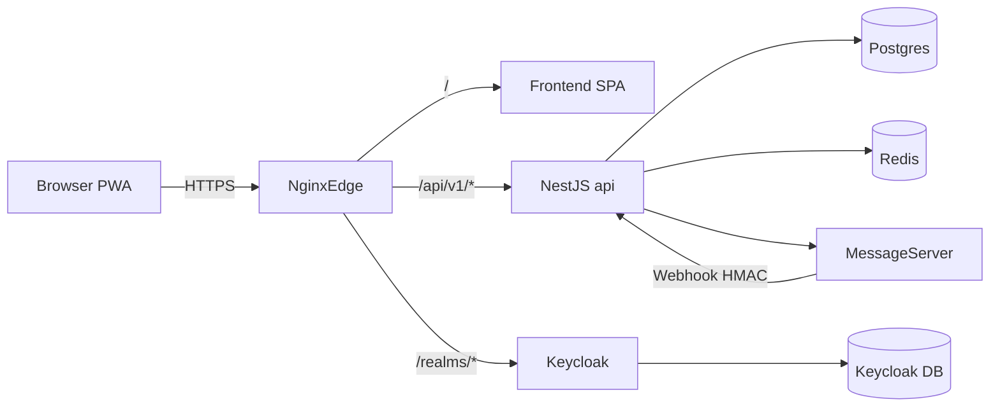

# CondoSync — Infraestrutura (VPS + Docker Compose)

Este diretório contém os artefatos para operar o CondoSync em produção com deploy
independente por serviço.

## Arquitetura



A infraestrutura é separada em:

- `edge`: `nginx`, `frontend`, `certbot`
- `core`: `api`, `postgres`, `redis`, `keycloak`, `keycloak-db`
- `messaging`: `api`, `message-server`

## Compose files

| Arquivo | Papel |
| --- | --- |
| `docker-compose.prod.yml` | Base estável (edge + core + messaging sem API override) |
| `docker-compose.api.yml` | Override da API para deploy isolado |
| `docker-compose.ip-only.yml` | Override para testes na EC2 sem DNS (HTTP puro) |

## Layout

```text
infra/
├── docker-compose.prod.yml
├── docker-compose.api.yml
├── nginx/
├── keycloak/
└── scripts/
    ├── setup-ec2.sh
    ├── init-ssl.sh
    ├── deploy-api.sh
    ├── deploy-frontend.sh
    └── deploy-message-server.sh
```

## Modo IP-only (teste sem DNS na EC2)

> **Para o passo a passo completo do zero ao deploy via GitHub Actions, leia
> [`DEPLOY_IP.md`](./DEPLOY_IP.md).** A seção abaixo é só um resumo rápido.

Use enquanto não há domínio comprado. O acesso é HTTP puro pelo IP da máquina
(`http://<IP-EC2>` para o app e `http://<IP-EC2>/auth` para o Keycloak).

Limitações:

- Sem TLS — Let's Encrypt não emite certificado para IP. Não rode `init-ssl.sh`.
- Frontend baked com IP via build-args (rebuild necessário ao migrar pro DNS).
- Liberar no Security Group da EC2: `22` (SSH) e `80` (HTTP).

```bash
cp infra/.env.prod.ip-only.example infra/.env.prod
nano infra/.env.prod   # ajuste senhas; o IP já está pré-preenchido (18.228.119.6)

cd infra
docker compose \
  -f docker-compose.prod.yml \
  -f docker-compose.api.yml \
  -f docker-compose.ip-only.yml \
  --env-file .env.prod up -d
```

> ⚠️ Na **primeira subida em IP-only** os 3 arquivos compose precisam estar juntos
> (`prod.yml` + `api.yml` + `ip-only.yml`). O serviço `api` é definido só em
> `api.yml` e o `ip-only.yml` aplica overrides nele.

Para deploy isolado da API/frontend/message-server em IP-only, exporte
`EXTRA_COMPOSE_FILE=docker-compose.ip-only.yml` antes dos scripts.
Os scripts de deploy já incluem `docker-compose.api.yml` automaticamente para
evitar compose inválido quando o override IP-only declarar apenas ajustes do
serviço `api`.

Migração para DNS (depois de comprar):

1. Apontar `A record` do `APP_DOMAIN` e `AUTH_DOMAIN` para o IP da EC2.
2. Editar `.env.prod` trocando IP por domínios reais e `APP_PUBLIC_URL=https://...`.
3. Reabrir `443` no Security Group.
4. `docker compose -f docker-compose.prod.yml --env-file .env.prod up -d` (sem o override IP).
5. `bash infra/scripts/init-ssl.sh` para emitir certificados.
6. Descomentar blocos HTTPS em `nginx/nginx.conf`.
7. Rebuild do frontend (workflow `frontend-release` com novos build-args).

## Primeira subida

```bash
cp infra/.env.prod.example infra/.env.prod
nano infra/.env.prod

cd infra
docker compose -f docker-compose.prod.yml --env-file .env.prod up -d

# Opcional TLS inicial
./scripts/init-ssl.sh
```

## Deploy isolado por serviço

### API

```bash
IMAGE_TAG=<sha> GHCR_USER=<user> GHCR_TOKEN=<pat> \
  /opt/condosync/infra/scripts/deploy-api.sh
```

### Frontend

```bash
FRONTEND_TAG=<sha> GHCR_USER=<user> GHCR_TOKEN=<pat> \
  /opt/condosync/infra/scripts/deploy-frontend.sh
```

### Message-server

```bash
MESSAGE_SERVER_TAG=<sha> GHCR_USER=<user> GHCR_TOKEN=<pat> \
  /opt/condosync/infra/scripts/deploy-message-server.sh
```

Todos os scripts fazem: `pull` da imagem, `up -d --no-deps`, validação de saúde
e rollback automático para a tag anterior em caso de falha.

## Backups rápidos

```bash
docker exec condosync-postgres pg_dump -U "$POSTGRES_USER" "$POSTGRES_DB" \
  | gzip > backup-app-$(date +%F).sql.gz

docker exec condosync-keycloak-db pg_dump -U keycloak keycloak \
  | gzip > backup-keycloak-$(date +%F).sql.gz
```

## Observabilidade rápida

```bash
docker compose -f infra/docker-compose.prod.yml -f infra/docker-compose.api.yml ps
docker logs -n 100 -f condosync-api
docker logs -n 100 -f condosync-message-server
docker inspect --format '{{.State.Health.Status}}' condosync-api
curl -fsS https://<APP_DOMAIN>/api/v1/health/ready | jq
```
