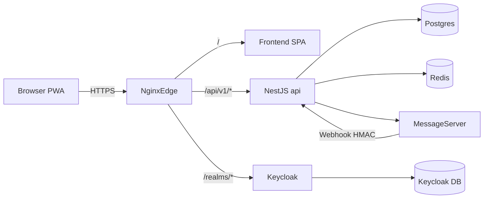

# CondoSync — Infraestrutura (VPS + Docker Compose)

Este diretório contém os artefatos para operar o CondoSync em produção com deploy
independente por serviço.

**Guia passo a passo (arquivos, ordem de subida, IP-only e DNS+TLS):** [`DEPLOY_VPS.md`](./DEPLOY_VPS.md).

## Arquitetura



A infraestrutura é separada em:

- `edge`: `nginx`, `frontend`, `certbot`
- `core`: `api`, `postgres`, `redis`, `keycloak`, `keycloak-db`
- `messaging`: `api`, `message-server`

## Compose files

| Arquivo | Papel |
| --- | --- |
| `docker-compose.prod.yml` | Base estável (edge + core + messaging) |
| `docker-compose.api.yml` | Serviço `api` + variáveis de ambiente |
| `docker-compose.build.yml` | Build local de api/frontend/message-server (sem registry) |

> Os mesmos 3 compose files atendem **DNS+TLS** e **IP-only**. O que muda
> entre os dois modos são apenas variáveis no `.env.prod` (ver
> `.env.prod.ip-only.example`).

## Layout

```text
infra/
├── docker-compose.prod.yml
├── docker-compose.api.yml
├── DEPLOY_VPS.md
├── nginx/
├── keycloak/
└── scripts/
    ├── setup-ec2.sh
    ├── init-ssl.sh
    ├── deploy-api.sh
    ├── deploy-frontend.sh
    └── deploy-message-server.sh
```

## Modo IP-only (teste sem DNS na EC2)

> Deploy na VPS é **build local** (`git pull` + `scripts/vps-up.sh`). Não usa GHCR
> nem GitHub Actions. Resumo IP-only em [`DEPLOY_IP.md`](./DEPLOY_IP.md).

Use enquanto não há domínio comprado. O acesso é HTTP puro pelo IP da máquina
(`http://<IP-EC2>` para o app e `http://<IP-EC2>/auth` para o Keycloak).

Limitações:

- Sem TLS — Let's Encrypt não emite certificado para IP. Não rode `init-ssl.sh`.
- Frontend baked com IP via build-args (rebuild necessário ao migrar pro DNS).
- Liberar no Security Group da EC2: `22` (SSH) e `80` (HTTP).

```bash
cp infra/.env.prod.ip-only.example infra/.env.prod
nano infra/.env.prod   # ajuste senhas; o IP já está pré-preenchido (18.228.119.6)

./scripts/vps-up.sh
```

O `.env.prod.ip-only.example` define `NGINX_CONF_FILE=nginx.ip-only.conf`,
`KC_PROXY=none`, `KEYCLOAK_BASE_URL` com `/auth` e as URLs públicas baseadas
em IP. O compose lê esses valores no boot — nenhum override `-f` é necessário.

Migração para DNS (depois de comprar):

1. Apontar `A record` do `APP_DOMAIN` e `AUTH_DOMAIN` para o IP da EC2.
2. Substituir `.env.prod` por uma cópia do `.env.prod.example` (DNS+TLS) com
   senhas e domínios reais.
3. Reabrir `443` no Security Group.
4. `./scripts/vps-up.sh` (mesmo comando — só o `.env.prod` mudou).
5. `bash infra/scripts/init-ssl.sh` para emitir certificados.
6. Descomentar blocos HTTPS em `nginx/nginx.conf`.
7. Rebuild do frontend: `./scripts/vps-rebuild.sh frontend`.

## Variáveis de ambiente

Produção usa **apenas** `infra/.env.prod` (modelo em `.env.prod.example`).  
Passe sempre `--env-file .env.prod`. Não precisa de `.env` na raiz nem `backend/.env` na VPS.

## Primeira subida

```bash
cp infra/.env.prod.example infra/.env.prod
nano infra/.env.prod

cd ~/condosync
git pull
./scripts/vps-up.sh

# Opcional TLS inicial
cd infra && ./scripts/init-ssl.sh
```

## Atualizar um serviço (após `git pull`)

```bash
./scripts/vps-rebuild.sh api
./scripts/vps-rebuild.sh frontend
./scripts/vps-rebuild.sh message-server
```

Ou os scripts em `infra/scripts/deploy-*.sh` (mesmo efeito, com healthcheck na API).

## Backups rápidos

```bash
docker exec condosync-postgres pg_dump -U "$POSTGRES_USER" "$POSTGRES_DB" \
  | gzip > backup-app-$(date +%F).sql.gz

docker exec condosync-keycloak-db pg_dump -U keycloak keycloak \
  | gzip > backup-keycloak-$(date +%F).sql.gz
```

## Observabilidade rápida

```bash
docker compose \
  -f infra/docker-compose.prod.yml \
  -f infra/docker-compose.api.yml \
  -f infra/docker-compose.build.yml \
  --env-file infra/.env.prod ps
docker logs -n 100 -f condosync-api
docker logs -n 100 -f condosync-message-server
docker inspect --format '{{.State.Health.Status}}' condosync-api
curl -fsS https://<APP_DOMAIN>/api/v1/health/ready | jq
```
